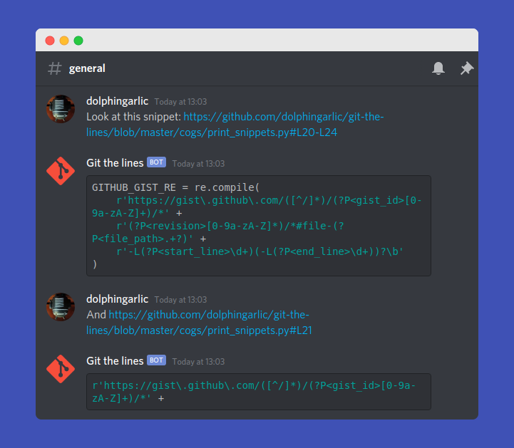

# Git the lines

A Discord bot that prints out the lines referenced in a GitHub or GitLab link

## Usage

Just send the link to the snippet - no need for extra commands! Git the lines even highlights the code for you

### Features

- GitHub
  - Public repos and gists
  - Private repos and gists (if self-hosting)
- GitLab
  - Public repos
- BitBucket
  - Public repos

## Commands

### Ping

Command: `g;ping`.

Action: Pings bot, returns bot delay in ms.

### About

Command: `g;about`.

Aliases: `g;stats`.

Action: Shows bot statistics and technical data.

### Help

Command: `g;help`.

Action: Shows help information.

### Invite

Command: `g;invite`.

Aliases: `g;topgg`.

Action: Sends a bot invite link.

### GitHub Repo

Command: `g;github`.

Aliases: `g;source`.

Action: Sends the bot GitHub repo link

## Get the bot

[Use this link](https://top.gg/bot/708364985021104198) to add the bot to your server

Alternatively, you can self-host the bot using Heroku, pythonanywhere, or any other hosting service. Simply create a file named `.env` and set `DISCORD_TOKEN` to your Discord bot token

## Contribute

We gladly accept any (constructive) contributions. Feel free to open issues and pull requests!
